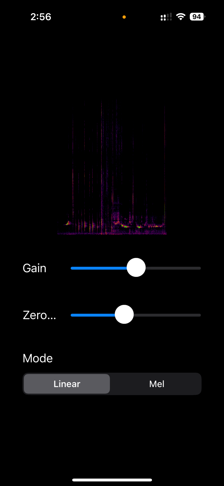
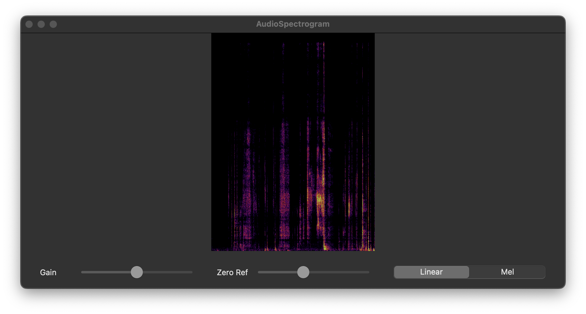

# Audio Spectrogram iOS/macOS

Audio spectrogram visualizer for iOS and macOS using Accelerate framework - adapted from [Apple's audio spectrogram sample code](https://developer.apple.com/documentation/accelerate/visualizing_sound_as_an_audio_spectrogram).

iOS | macOS
-- | --
 | 

## Overview

This project demonstrates how to visualize audio as a spectrogram on both iOS and macOS. It's based on Apple's sample code but enhanced to work on both platforms.

For detailed technical information and implementation details, please refer to the [original documentation](https://developer.apple.com/documentation/accelerate/visualizing_sound_as_an_audio_spectrogram).

## Requirements

- iOS 16.0+ / macOS 13.0+
- Xcode 15.0+
- Swift 5.9+

## License

See LICENSE.txt file
