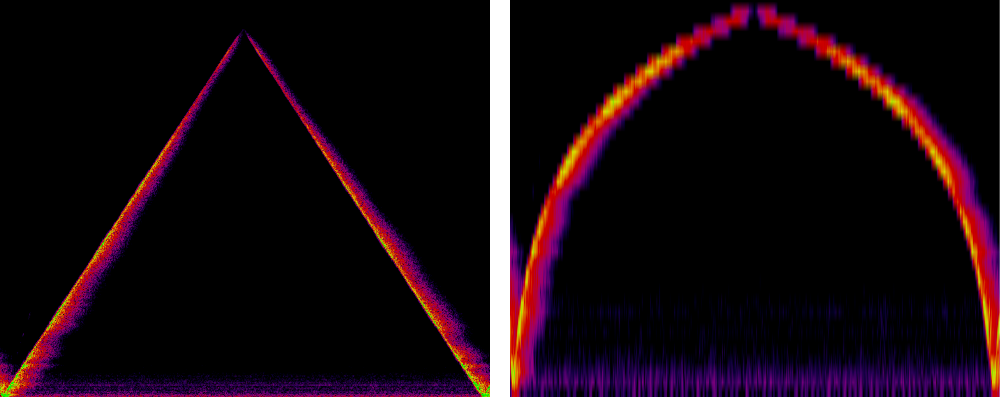
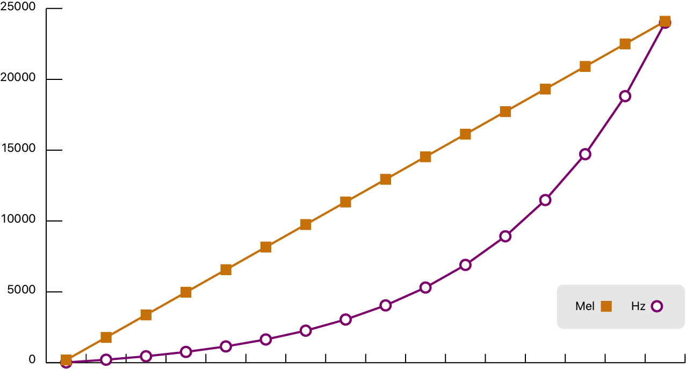
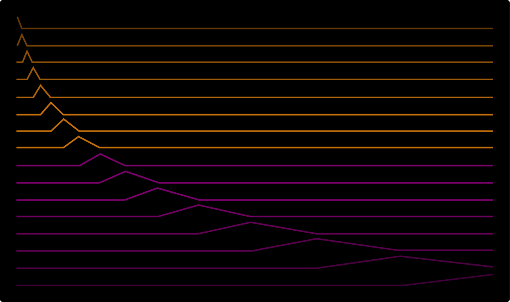
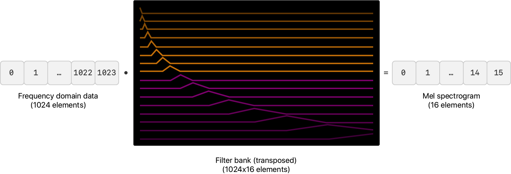

# Visualizing sound as an audio spectrogram

Share image data between vDSP and vImage to visualize audio that a device microphone captures.

## Overview

This sample code project captures audio from a macOS device's microphone and uses a combination of routines from vImage and vDSP to render the audio as an _audio spectrogram_. Audio spectrograms visualize audio in 2D using one axis to represent time and the other axis to represent frequency. Color represents the amplitude of the time-frequency pair. 

You can use audio spectrograms for signal analysis. For example, a spectrogram can help identify audio issues, such as low- or high-frequency noise, or short-impulse noises like clicks and pops that may not be immediately obvious to the human ear. Spectrograms can also assist in audio classification using neural networks for tasks such as bird song and speech recognition.

The image below shows the audio spectrogram that this sample created from the _Stargate Opening_ sound effect in [GarageBand](https://www.apple.com/ios/garageband/). The horizontal axis represents time, and the vertical axis represents frequency. The sample calculates the color that represents amplitude using a procedurally generated multidimensional lookup table.


The sample creates an audio spectrogram by performing a discrete cosine transform (DCT) on audio samples. The DCT computes the frequency components of an audio signal and represents the audio as a series of amplitudes at the component frequencies. DCTs are related to Fourier transforms, but use real values rather than complex values. You can learn more about Fourier transforms at [_Finding the Component Frequencies in a Composite Sine Wave_](https://developer.apple.com/documentation/accelerate/finding_the_component_frequencies_in_a_composite_sine_wave).

The spectrogram scrolls horizontally so that the most recent sample renders on the right side of the device's screen.

For each sample buffer that AVFoundation provides, the app appends that data to the `rawAudioData` array.  At the same time, the app applies a DCT to the first `sampleCount` elements of `rawAudioData` and produces a single-precision frequency-domain representation. 

The code appends the newly generated frequency-domain values to `frequencyDomainValues` and discards `sampleCount` elements from the beginning. It is this appending and discarding of data that generates the scrolling effect.

A vImage pixel buffer, `planarImageBuffer`, shares data with `frequencyDomainValues` and the multidimensional lookup table uses that as a planar source to populate three additional planar buffers that represent the red, green, and blue channels of the spectrogram image. The sample app interleaves the red, green, and blue planar buffers to display the RGB spectrogram image.

Before exploring the code, build and run the app to familiarize yourself with the different visual results it generates from different sounds.

## Define the spectrogram size

The sample defines two constants that specify the size of the spectrogram.

* `sampleCount` defines the number of individual samples that pass to the DCT, and the resolution of the displayed frequencies. 
* `bufferCount` controls the number of displayed buffers. 

The sample also specifies a hop size that controls the overlap between frames of data and ensures that the spectrogram doesn't lose any audio information at the start and end of each sample.

``` swift
/// The number of samples per frame — the height of the spectrogram.
static let sampleCount = 1024

/// The number of displayed buffers — the width of the spectrogram.
static let bufferCount = 768

/// Determines the overlap between frames.
static let hopCount = 512
```

## Process the audio data 

The `processData(values:)` function processes the first `sampleCount` samples from  `rawAudioData` by performing the DCT and appending the frequency-domain representation data to the array that creates the vImage buffer and, ultimately, the audio spectrogram image.

To avoid recreating working arrays with each iteration, the following code creates reusable buffers that `processData(values:)` uses:

``` swift
/// A reusable array that contains the current frame of time-domain audio data as single-precision
/// values.
var timeDomainBuffer = [Float](repeating: 0,
                               count: sampleCount)

/// A resuable array that contains the frequency-domain representation of the current frame of
/// audio data.
var frequencyDomainBuffer = [Float](repeating: 0,
                                    count: sampleCount)
```

The sample calls [`convertElements(of:to:)`](https://developer.apple.com/documentation/accelerate/vdsp/3240884-convertelements) to convert 16-bit integer audio samples to single-precision floating-point values.

``` swift
vDSP.convertElements(of: values,
                     to: &timeDomainBuffer)
```

To reduce spectral leakage, the sample multiplies the signal by a Hann window and performs the DCT. The following code generates the window:

``` swift
let hanningWindow = vDSP.window(ofType: Float.self,
                                usingSequence: .hanningDenormalized,
                                count: sampleCount,
                                isHalfWindow: false)
```

To learn more about using windows to reduce spectral leakage, see [_Using Windowing with Discrete Fourier Transforms_](https://developer.apple.com/documentation/accelerate/using_windowing_with_discrete_fourier_transforms).

The following code multiplies the time-domain data by the Hann window and performs the forward DCT:

``` swift
vDSP.multiply(timeDomainBuffer,
              hanningWindow,
              result: &timeDomainBuffer)

forwardDCT.transform(timeDomainBuffer,
                     result: &frequencyDomainBuffer)
```

## Define the pseudocolor multidimensional lookup tables

The following code creates a [vImage.MultidimensionalLookupTable](https://developer.apple.com/documentation/accelerate/vimage/multidimensionallookuptable) that the sample uses to create the pseudocolor rendering. The function returns dark blue for low values, graduates through red, and returns full-brightness green for `1.0`.

``` swift
static var multidimensionalLookupTable: vImage.MultidimensionalLookupTable = {
    let entriesPerChannel = UInt8(32)
    let srcChannelCount = 1
    let destChannelCount = 3
    
    let lookupTableElementCount = Int(pow(Float(entriesPerChannel),
                                          Float(srcChannelCount))) *
    Int(destChannelCount)
    
    let tableData = [UInt16](unsafeUninitializedCapacity: lookupTableElementCount) {
        buffer, count in
        
        /// Supply the samples in the range `0...65535`. The transform function
        /// interpolates these to the range `0...1`.
        let multiplier = CGFloat(UInt16.max)
        var bufferIndex = 0
        
        for gray in ( 0 ..< entriesPerChannel) {
            /// Create normalized red, green, and blue values in the range `0...1`.
            let normalizedValue = CGFloat(gray) / CGFloat(entriesPerChannel - 1)
          
            // Define `hue` that's blue at `0.0` to red at `1.0`.
            let hue = 0.6666 - (0.6666 * normalizedValue)
            let brightness = sqrt(normalizedValue)
            
            let color = NSColor(hue: hue,
                                saturation: 1,
                                brightness: brightness,
                                alpha: 1)
            
            var red = CGFloat()
            var green = CGFloat()
            var blue = CGFloat()
            
            color.getRed(&red,
                         green: &green,
                         blue: &blue,
                         alpha: nil)
 
            buffer[ bufferIndex ] = UInt16(green * multiplier)
            bufferIndex += 1
            buffer[ bufferIndex ] = UInt16(red * multiplier)
            bufferIndex += 1
            buffer[ bufferIndex ] = UInt16(blue * multiplier)
            bufferIndex += 1
        }
        
        count = lookupTableElementCount
    }
    
    let entryCountPerSourceChannel = [UInt8](repeating: entriesPerChannel,
                                             count: srcChannelCount)
    
    return vImage.MultidimensionalLookupTable(entryCountPerSourceChannel: entryCountPerSourceChannel,
                                              destinationChannelCount: destChannelCount,
                                              data: tableData)
}()
```

The following image shows the color that the function returns with inputs from `0.0` through `1.0`:


## Prepare the vImage pixel buffers to display the audio spectrogram

To display the audio spectrogram, the app creates a temporary planar [`vImage.PixelBuffer`](https://developer.apple.com/documentation/accelerate/vimage/pixelbuffer) that shares memory with the frequency-domain values. 

The following code applies the multidimensional lookup table to the grayscale information in the temporary buffer to populate three planar buffers that represent the red, green, and blue channels. Because the vImage functions that generate a Core Graphics image from a pixel buffer require an interleaved buffer, the code interleaves the red, green, and blue buffer into `rgbImageBuffer`.

``` swift
func makeAudioSpectrogramImage() -> CGImage {
    frequencyDomainValues.withUnsafeMutableBufferPointer {
        
        let planarImageBuffer = vImage.PixelBuffer(
            data: $0.baseAddress!,
            width: AudioSpectrogram.sampleCount,
            height: AudioSpectrogram.bufferCount,
            byteCountPerRow: AudioSpectrogram.sampleCount * MemoryLayout<Float>.stride,
            pixelFormat: vImage.PlanarF.self)
        
        AudioSpectrogram.multidimensionalLookupTable.apply(
            sources: [planarImageBuffer],
            destinations: [redBuffer, greenBuffer, blueBuffer],
            interpolation: .half)
        
        rgbImageBuffer.interleave(
            planarSourceBuffers: [redBuffer, greenBuffer, blueBuffer])
    }
    
    return rgbImageBuffer.makeCGImage(cgImageFormat: rgbImageFormat) ?? AudioSpectrogram.emptyCGImage
}
```

## Compute the mel spectrum using linear algebra

In addition to the linear audio spectrogram, the sample app provides a mode to render audio as a mel spectrogram. The `computeMelSpectrogram(values:)` function rescales the frequency-domain buffer from a linear scale to the mel scale.

The mel scale is a scale of pitches that human hearing generally perceives to be equidistant from each other. As frequency increases, the interval, in hertz, between mel scale values (or simply _mels_) increases. The name _mel_ derives from _melody_ and indicates that the scale is based on the comparison between pitches. The mel spectrogram remaps the values in hertz to the mel scale.

The linear audio spectrogram is ideally suited for use cases where all frequencies have equal importance, while mel spectrograms are better suited when modeling human hearing perception. Mel spectrogram data is also suited for use in audio classification.

A mel spectrogram differs from a linearly scaled audio spectrogram in two ways:

* A mel spectrogram logarithmically renders frequencies above a certain threshold (the _corner frequency_). For example, in the linearly scaled spectrogram, the vertical space between 1000 Hz and 2000 Hz is half of the vertical space between 2000 Hz and 4000 Hz. In the mel spectrogram, the space between those ranges is approximately the same. This scaling is analogous to human hearing, where it's easier to distinguish between similar low frequency sounds than similar high frequency sounds.
*  A mel spectrogram computes its output by multiplying frequency-domain values by a filter bank. 

The sample builds the filter bank from a series of overlapping triangular windows at a series of evenly spaced mels. The number of elements in a single frame in a mel spectrogram is equal to the number of filters in the filter bank.

The following image shows the linear audio spectrogram and the mel spectrogram of the same linearly increasing and decreasing tone. The tone starts at 20 Hz, rises to 22,050 Hz, and drops back to 20 Hz. The image shows that the audio spectrogram represents the objective signal, but the mel spectrogram mirrors human perception, that is, the curve flattens and indicates reduced differentiation between high frequencies.



In this case, the mel spectrogram consists of 40 filters, so the spectrogram has a lower vertical resolution than the linear spectrogram.


## Define the mel frequencies

The sample creates an array, `melFilterBankFrequencies`, that contains the indices of `frequencyDomainBuffer` that represent the mel scale frequencies. For example, if the Nyquist frequency is 22,050 Hz and `frequencyDomainBuffer` contains 1024 elements, a value of 512 in `melFilterBankFrequencies` represents 11,025 Hz.


The `static MelSpectrogram.populateMelFilterBankFrequencies(_:maximumFrequency:)` function populates `melFilterBankFrequencies` with the logarithmically increasing indices based on the linearly interpolated increasing mel frequencies in  `melFilterBankFrequencies`.

``` swift
func frequencyToMel(_ frequency: Float) -> Float {
    return 2595 * log10(1 + (frequency / 700))
}

func melToFrequency(_ mel: Float) -> Float {
    return 700 * (pow(10, mel / 2595) - 1)
}

let minMel = frequencyToMel(frequencyRange.lowerBound)
let maxMel = frequencyToMel(frequencyRange.upperBound)
let bankWidth = (maxMel - minMel) / Float(filterBankCount - 1)

let melFilterBankFrequencies: [Int] = stride(from: minMel, to: maxMel, by: bankWidth).map {
    let mel = Float($0)
    let frequency = melToFrequency(mel)
    
    return Int((frequency / frequencyRange.upperBound) * Float(sampleCount))
}
```

The following line chart shows 16 generated mel frequencies as squares and the corresponding frequencies in hertz as circles: 



## Create the filter bank

The sample creates the filter bank matrix with `filterBankCount` rows and `sampleCount` columns. Each row contains a triangular window that starts at the previous frequency, peaks at the current frequency, and ends at the next frequency. For example, the following graphic illustrates the values for a filter bank that contains 16 values:



The `static MelSpectrogram.populateFilterBank(_:melFilterBankFrequencies:)` function populates the `filterBank` array. The function uses [`vDSP_vgen`](https://developer.apple.com/documentation/accelerate/1449703-vdsp_vgen) to generate the attack and decay phases of each triangle.

``` swift
for i in 0 ..< melFilterBankFrequencies.count {
    
    let row = i * sampleCount
    
    let startFrequency = melFilterBankFrequencies[ max(0, i - 1) ]
    let centerFrequency = melFilterBankFrequencies[ i ]
    let endFrequency = (i + 1) < melFilterBankFrequencies.count ?
    melFilterBankFrequencies[ i + 1 ] : sampleCount - 1
    
    let attackWidth = centerFrequency - startFrequency + 1
    let decayWidth = endFrequency - centerFrequency + 1
    
    // Create the attack phase of the triangle.
    if attackWidth > 0 {
        vDSP_vgen(&endValue,
                  &baseValue,
                  filterBank.baseAddress!.advanced(by: row + startFrequency),
                  1,
                  vDSP_Length(attackWidth))
    }
    
    // Create the decay phase of the triangle.
    if decayWidth > 0 {
        vDSP_vgen(&baseValue,
                  &endValue,
                  filterBank.baseAddress!.advanced(by: row + centerFrequency),
                  1,
                  vDSP_Length(decayWidth))
    }
}
```

## Use a matrix multiply to compute the mel spectrogram

The sample performs a matrix multiply of each frame of frequency-domain data with the filter bank to produce a frame of mel-scaled values.

The following image shows the matrix multiply. The frame of 1024 frequency-domain values is multiplied by 16 overlapping triangular windows, returning the 16-element mel-scaled values.



The following code uses [`cblas_sgemm`](https://developer.apple.com/documentation/accelerate/1513264-cblas_sgemm) to perform the matrix multiply:

``` swift
values.withUnsafeBufferPointer { frequencyDomainValuesPtr in
    cblas_sgemm(CblasRowMajor,
                CblasTrans, CblasTrans,
                1,
                Int32(MelSpectrogram.filterBankCount),
                Int32(sampleCount),
                1,
                frequencyDomainValuesPtr.baseAddress,
                1,
                filterBank.baseAddress, Int32(sampleCount),
                0,
                sgemmResult.baseAddress, Int32(MelSpectrogram.filterBankCount))
}
```

On return, the sample adds the result of the matrix multiply in `sgemmResult` to the `melSpectrumValues` that contain `bufferCount * filterBankCount` elements. 
